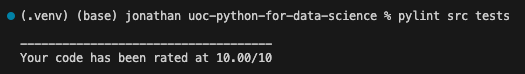
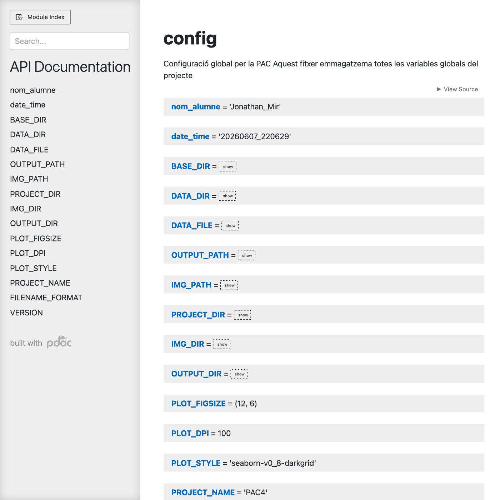
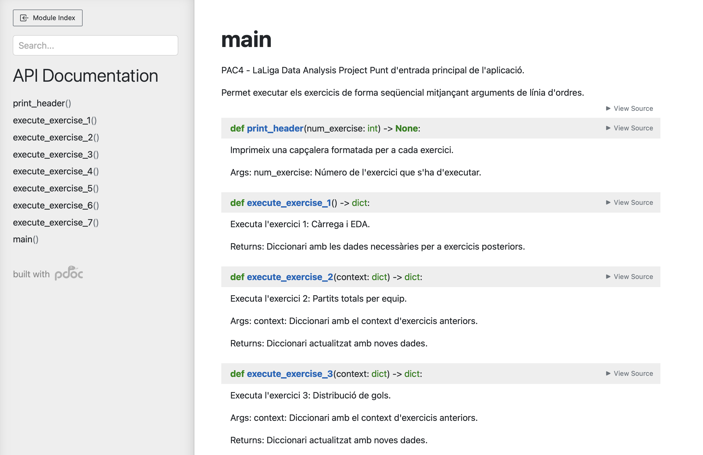
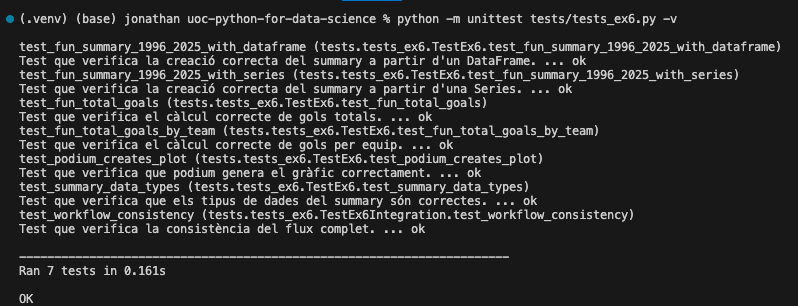

# PAC4 - Anàlisi de Dades de LaLiga (1995-2025)

**Nom:** Jonathan Mir  
**Assignatura:** 22.503 - Programació per a la Ciència de Dades  
**Universitat:** UOC - Universitat Oberta de Catalunya  
**Llicència:** MIT, definida al fitxer [LICENSE](LICENSE).

## Descripció

Aquest projecte analitza dades històriques de partits de LaLiga entre 1995 i
2025. El codi està organitzat en mòduls Python per exercici i permet executar el
flux complet des de línia de comandes.

El projecte inclou:

- Càrrega i anàlisi exploratòria del dataset.
- Càlcul de partits totals per equip.
- Distribució de gols locals i visitants.
- Anàlisi de resultats finals dels partits.
- Classificació històrica per punts.
- Resum de gols i podi dels millors equips.
- Gràfic de connexions entre equips.
- Tests unitaris de l'exercici 6.
- Documentació HTML generada amb `pdoc`.

## Estructura del Projecte

```text
.
├── src/
│   ├── main.py                 # Punt d'entrada principal
│   ├── config.py               # Configuració global del projecte
│   ├── CAT-PEC4.ipynb          # Notebook de treball amb l'enunciat
│   ├── data/
│   │   └── raw/
│   │       └── LaLiga_Matches.csv
│   ├── exercises/
│   │   ├── __init__.py
│   │   ├── ex1.py              # Càrrega i EDA
│   │   ├── ex2.py              # Partits totals
│   │   ├── ex3.py              # Distribució de gols
│   │   ├── ex4.py              # Resultats FTR
│   │   ├── ex5.py              # Classificació global
│   │   ├── ex6.py              # Summary, podi i funcions testades
│   │   └── ex7.py              # Gràfic de connexions
│   └── img/                    # Gràfiques generades
├── tests/
│   └── tests_ex6.py            # Tests unitaris de l'exercici 6
├── doc/                        # Documentació HTML generada
├── screenshots/                # Captures i evidències de verificació
├── requirements.txt            # Dependències d'execució del projecte
├── README.md                   # Instruccions del projecte
└── LICENSE                     # Llicència MIT
```

La carpeta `references/` conté material de consulta i no forma part de la
documentació generada ni és necessària per executar el projecte.

## Instal·lació en un entorn virtual

Requisits previs:

- Python 3.8 o superior.
- `pip`.
- Terminal situada a l'arrel del projecte.

Crear i activar un entorn virtual:

```bash
python3 -m venv .venv
source .venv/bin/activate
```

En Windows:

```bash
python -m venv .venv
.venv\Scripts\activate
```

Instal·lar les dependències d'execució:

```bash
python -m pip install --upgrade pip
python -m pip install -r requirements.txt
```

El fitxer [requirements.txt](requirements.txt) només inclou llibreries associades
a l'execució del projecte. Les eines de linting, documentació i tests
s'instal·len per separat quan calen.

## Execució del Projecte

Executar tots els exercicis:

```bash
source .venv/bin/activate
cd src
python main.py
```

També es pot indicar fins a quin exercici executar. Per exemple:

```bash
cd src
python main.py -ex 1
python main.py -ex 5
python main.py -ex 7
```

Consultar l'ajuda:

```bash
cd src
python main.py --help
```

Les gràfiques generades es desen a la carpeta `src/img/`.

## Comprovació de Linting

El projecte inclou el fitxer [.pylintrc](.pylintrc) amb la configuració de
Pylint. Com que Pylint és una eina de qualitat de codi i no una dependència
d'execució, no està inclosa a `requirements.txt`.

Els criteris aplicats a [.pylintrc](.pylintrc) són:

- `persistent=no`: evita que Pylint generi fitxers de cache persistents.
- `ignore=references`: exclou la carpeta `references/`, que només conté material
  de consulta i no forma part del codi lliurable del projecte.
- `max-line-length=100`: fixa la longitud màxima de línia en 100 caràcters per
  mantenir el codi llegible sense ser excessivament restrictiu.
- `disable=duplicate-code`: desactiva l'avís de codi duplicat, ja que alguns
  exercicis comparteixen patrons semblants per generar i desar gràfiques.

Instal·lar i executar Pylint:

```bash
source .venv/bin/activate
python -m pip install pylint
pylint src tests
```

Mostrem a continuació la sortida de l'execució:



En aquest cas, hem aconseguit una puntuació de 10/10 en l'aplicació de la guia d'estil PEP8.

## Generació de Documentació

Totes les funcions del codi de `src/` tenen docstrings. La documentació HTML es
genera amb `pdoc`, que produeix una sortida més llegible que `pydoc`. La
generació apunta explícitament als mòduls del projecte i exclou `references/`.

Instal·lar `pdoc` i generar la documentació:

```bash
source .venv/bin/activate
python -m pip install pdoc
PYTHONPATH=src MPLCONFIGDIR=/tmp python -m pdoc config main exercises -o doc
```

Obrir la documentació:

```bash
open doc/index.html
```

En sistemes sense la comanda `open`, obriu manualment el fitxer
[doc/index.html](doc/index.html) amb el navegador. 

Mostrem a continuació algunes captures de la documentació generada:






## Comprovació dels Tests

Els tests unitaris s'han desenvolupat al fitxer [tests/tests_ex6.py](tests/tests_ex6.py)

Els tests es poden executar amb `unittest`, que forma part de la llibreria
estàndard de Python:

```bash
source .venv/bin/activate
python -m unittest tests/tests_ex6.py -v
```

El resultat dels tests aplicats en l'exercici 5 es mostra a continuació:



Opcionalment, si es vol executar amb `pytest`, cal instal·lar-lo per separat:

```bash
python -m pip install pytest
python -m pytest tests/tests_ex6.py -v
```
Com es mostra a continuació, el resultat de la sortida és més visual:


## Dependències del Projecte

Les dependències d'execució són:

- `pandas`: manipulació i anàlisi de dades.
- `matplotlib`: generació de gràfiques.
- `networkx`: construcció i visualització de grafs.
- `ipython`: suport per a `display` en la sortida dels exercicis.

El fitxer [requirements.txt](requirements.txt) no inclou `pylint`, `pdoc`,
`pytest` ni altres eines auxiliars, seguint el requisit de l'exercici 12.

## Llicència

El projecte es distribueix sota la llicència MIT. El text complet es troba a
[LICENSE](LICENSE).

## Comandes per Pujar el Projecte a GitHub

Inicialitzar el repositori si encara no existeix:

```bash
git init
git add README.md requirements.txt LICENSE src tests doc screenshots .pylintrc
git commit -m "Entrega PAC4 projecte LaLiga"
```

Crear un repositori buit a GitHub i enllaçar-lo:

```bash
git branch -M main
git remote add origin https://github.com/USUARI/NOM_REPOSITORI.git
git push -u origin main
```

Per pujades posteriors:

```bash
git status
git add .
git commit -m "Actualitza projecte"
git push
```
